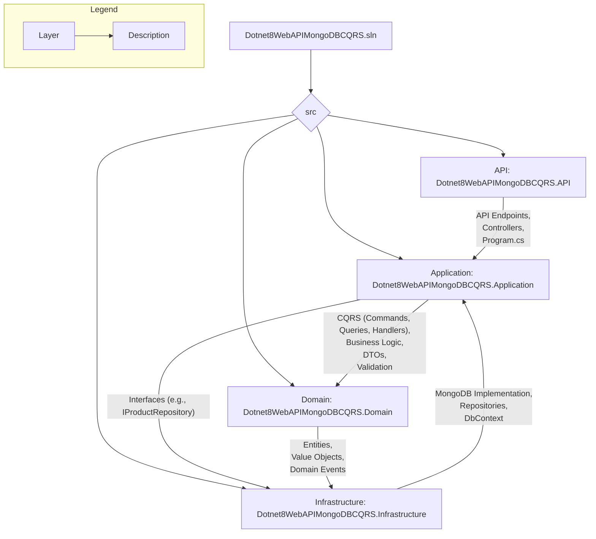
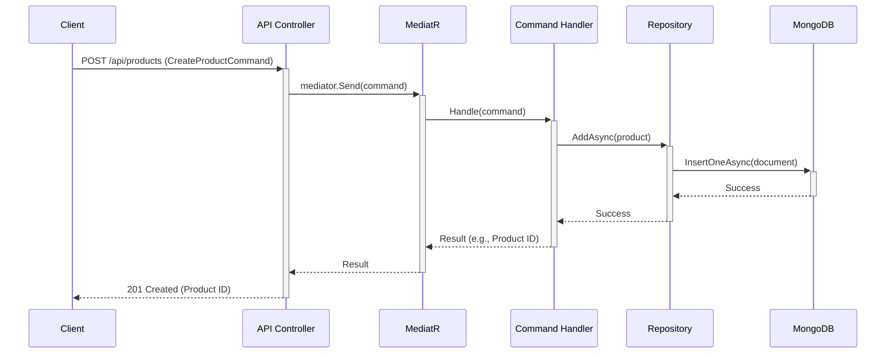
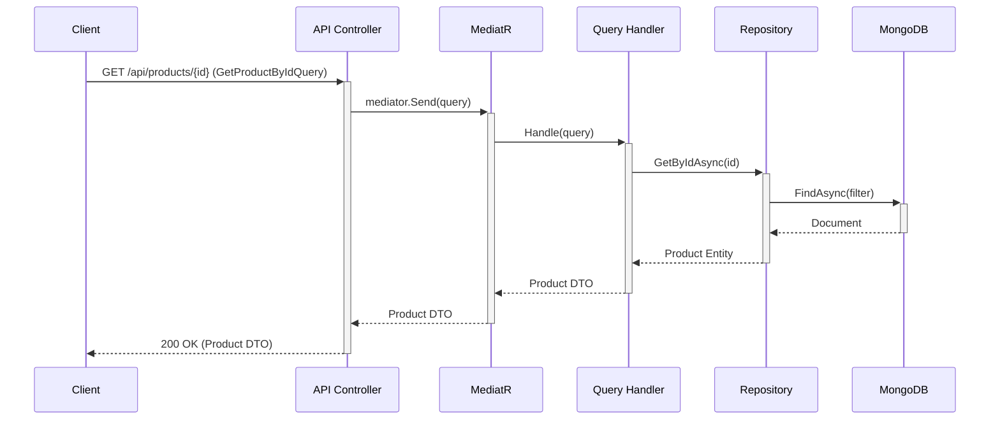
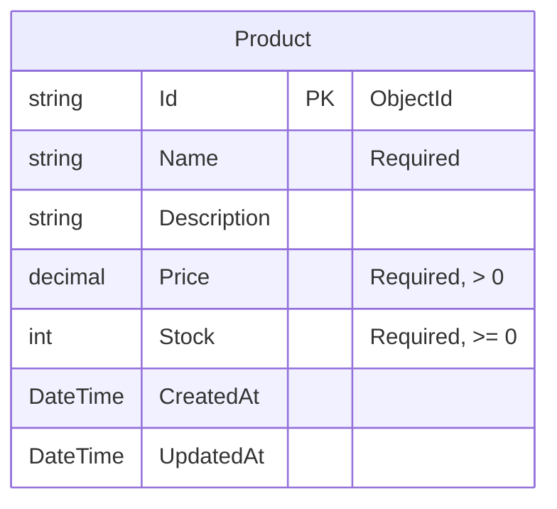

# Dotnet8WebAPIMongoDBCQRS 系統架構設計規格書

## 1. 簡介

本文件旨在為 `Dotnet8WebAPIMongoDBCQRS` 專案提供詳細的系統架構設計。此專案是一個基於 .NET 8 WebAPI、採用 CQRS (命令查詢責任分離) 模式，並以 MongoDB 作為資料庫的 CRUD (建立、讀取、更新、刪除) 應用程式。

## 2. 技術選型與分析

### 2.1. CQRS 框架：MediatR

**分析：**

在 .NET 生態系中，`MediatR` 是實現中介者模式 (Mediator Pattern) 最受歡迎且功能強大的函式庫，非常適合用來實現 CQRS 模式。

*   **優點：**
    *   **簡化相依性：** 它將請求的發送者與處理者完全解耦，避免了控制器 (Controller) 直接依賴大量的服務。控制器只需依賴 `IMediator` 介面即可。
    *   **清晰的職責分離：** 每個 Command 和 Query 都有其對應的 Handler，使得每個類別的職責單一且明確。
    *   **易於測試：** 由於 Handlers 是獨立的類別，因此可以輕易地對其進行單元測試。
    *   **強大的管線 (Pipeline) 功能：** 提供 `IPipelineBehavior` 介面，可用於實現橫切關注點，例如日誌、驗證、快取和交易管理，而無需修改核心業務邏輯。
    *   **與 .NET DI 深度整合：** `AddMediatR` 擴充方法可以輕鬆掃描並註冊所有相關的 Handlers 和 Behaviors。

**建議：**

基於其成熟度、社群支援度以及與 .NET 8 的無縫整合能力，**強烈建議使用 MediatR** 作為本專案的 CQRS 實現框架。

### 2.2. 資料庫：MongoDB

**分析：**

MongoDB 作為一個 NoSQL 文件資料庫，非常適合需要靈活資料模型和高擴展性的應用程式。

*   **優點：**
    *   **彈性的 Schema：** 文件導向的儲存方式 (BSON) 讓資料結構的修改變得容易，適合敏捷開發。
    *   **高效能：** 對於大量的讀寫操作有很好的效能表現。
    *   **擴展性：** 易於進行水平擴展 (Sharding)。
    *   **豐富的查詢語言：** 提供強大的查詢功能。

**最佳實踐：**

*   **使用官方驅動程式：** 務必使用官方提供的 `MongoDB.Driver` for .NET，以確保最佳的效能和相容性。
*   **單例連線：** `IMongoClient` 物件應在應用程式生命週期中註冊為單例 (Singleton)，因為它內部已經實現了連線池管理。
*   **依賴注入：** 將 `IMongoDatabase` 或 `IMongoCollection<T>` 注入到需要存取資料庫的 Handlers 中，而不是直接注入 `IMongoClient`。
*   **善用異步操作：** `MongoDB.Driver` 提供了完整的異步 API (`...Async` 方法)，在 I/O 密集的 WebAPI 中應全程使用，以避免線程阻塞。
*   **BsonClassMap：** 使用 `BsonClassMap.RegisterClassMap<T>()` 來精確地設定 C# 物件與 MongoDB 文件之間的對應關係，可以更好地控制欄位名稱、預設值、索引等。

## 3. 系統架構

### 3.1. 專案結構圖

*   **API (Dotnet8WebAPIMongoDBCQRS.API):** 應用程式的進入點，包含 Controllers、`Program.cs` 進行服務註冊、中介軟體設定等。此層級只會依賴 Application 層。
*   **Application (Dotnet8WebAPIMongoDBCQRS.Application):** 包含核心業務邏輯。定義 Commands、Queries、Handlers，以及 DTOs (Data Transfer Objects)。此層級會定義資料庫操作的介面 (Repositories)。
*   **Domain (Dotnet8WebAPIMongoDBCQRS.Domain):** 包含業務領域的核心，如實體 (Entities)、值物件 (Value Objects) 和領域事件 (Domain Events)。此層不依賴任何其他層。
*   **Infrastructure (Dotnet8WebAPIMongoDBCQRS.Infrastructure):** 包含外部服務的具體實現，例如資料庫存取 (MongoDB Repositories)、檔案服務等。此層會實現 Application 層定義的介面。

### 3.2. CQRS 流程圖

#### Command 流程 (寫入操作)

#### Query 流程 (讀取操作)

### 3.3. 資料庫關聯圖 (ERD)

以一個簡單的 `Product` 為例：

*   **Collection:** `Products`
*   **Id:** 使用 MongoDB 原生的 `ObjectId` 作為主鍵，對應到 C# 的 `string` 型別並使用 `[BsonId]` 和 `[BsonRepresentation(BsonType.ObjectId)]` 標註。

## 4. API 端點定義

假設我們要對 `Product` 進行 CRUD 操作。

| 功能 | HTTP 方法 | 端點 | 請求 Body (範例) | 成功回應 (範例) | 失敗回應 (範例) |
| :--- | :--- | :--- | :--- | :--- | :--- |
| **建立產品** | `POST` | `/api/products` | `{ "name": "Laptop", "price": 1200, "stock": 50 }` | `201 Created` `{ "id": "60d5ec49e9a3e4b7b4a7b4a1" }` | `400 Bad Request` `{ "errors": { "Name": ["Name is required"] } }` |
| **查詢單一產品** | `GET` | `/api/products/{id}` | (N/A) | `200 OK` `{ "id": "...", "name": "Laptop", ... }` | `404 Not Found` |
| **查詢所有產品** | `GET` | `/api/products` | (N/A) | `200 OK` `[ { "id": "...", "name": "Laptop", ... }, ... ]` | (N/A) |
| **更新產品** | `PUT` | `/api/products/{id}` | `{ "name": "Gaming Laptop", "price": 1500, "stock": 45 }` | `204 No Content` | `404 Not Found` 或 `400 Bad Request` |
| **刪除產品** | `DELETE` | `/api/products/{id}` | (N/A) | `204 No Content` | `404 Not Found` |

## 5. 測試案例

| API 端點 | 測試情境 | 預期結果 |
| :--- | :--- | :--- |
| **POST /api/products** | **成功：** 提供所有必要欄位且格式正確。 | 回應 `201 Created`，Body 包含新產品的 ID。資料庫中應存在該筆新資料。 |
| | **失敗：** 未提供 `name` 欄位。 | 回應 `400 Bad Request`，Body 包含欄位驗證錯誤訊息。 |
| **GET /api/products/{id}** | **成功：** 提供一個存在於資料庫中的 ID。 | 回應 `200 OK`，Body 包含對應的產品資料。 |
| | **失敗：** 提供一個不存在的 ID。 | 回應 `404 Not Found`。 |
| **PUT /api/products/{id}** | **成功：** 提供存在的 ID 和完整的更新資料。 | 回應 `204 No Content`。資料庫中對應的資料應被更新。 |
| | **失敗：** 提供不存在的 ID。 | 回應 `404 Not Found`。 |
| **DELETE /api/products/{id}** | **成功：** 提供一個存在的 ID。 | 回應 `204 No Content`。資料庫中應不存在該筆資料。 |
| | **失敗：** 提供一個不存在的 ID。 | 回應 `404 Not Found`。 |